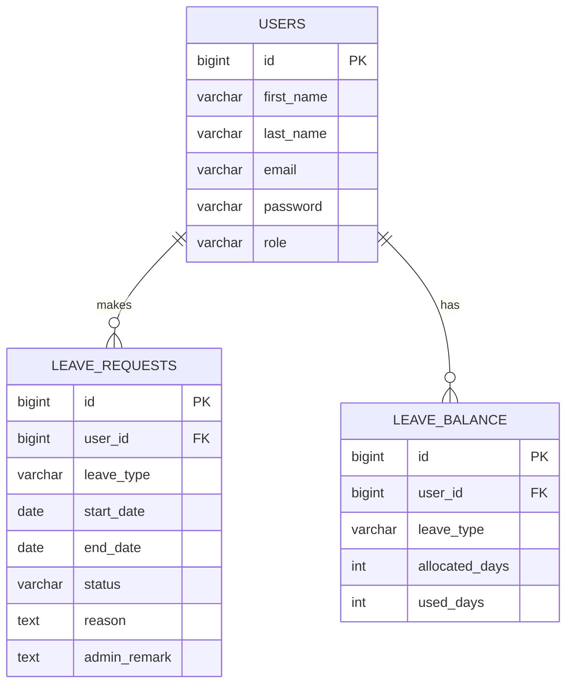

# Database Schema

## ER Diagram

## Description
- **USERS:** Stores employee and admin credentials.
- **LEAVE_REQUESTS:** Tracks the lifecycle of applied leaves.
- **LEAVE_BALANCE:** Normalised tally of remaining and used leaves.
